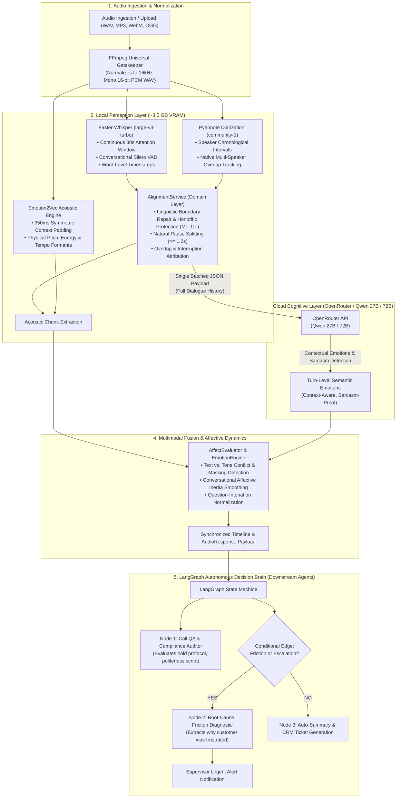

# Multimodal Conversational Audio Sentiment & Intelligence Platform

A high-performance, modular backend platform for **Speech-to-Text (ASR)**, **Speaker Diarization with Native Overlap Detection**, **Acoustic Speech Emotion Recognition (SER)**, and **Contextual Dialogue Reasoning (Qwen / OpenRouter & LangGraph)**.

Designed specifically for contact centers, customer experience analytics, and telephony dialogue understanding.

---

## Architecture Overview

The platform uses a **Hexagonal (Ports & Adapters) Architecture** that decouples hardware-intensive local signal perception from cloud-based contextual LLM reasoning:



---

## Key Design Principles

### 1. Continuous Transcription (No Hallucinations)
Unlike naive pipelines that pre-slice audio before sending it to Whisper, this pipeline transcribes the complete audio continuously with word-level timestamps. This preserves Whisper's 30-second cross-attention window, completely eliminating truncation hallucinations.

### 2. Conversational Overlap as Intelligence
Multi-speaker overlaps are not discarded or forced into blind source separation. Overlaps are detected natively via Pyannote and surfaced as conversational metrics:
- **`is_interruption`**: Detects when a speaker cuts in while another is speaking.
- **`interrupted_by`**: Identifies the interrupting speaker identity.
- **`overlap_duration` & `overtalk_ratio`**: Quantifies speech competition across the call.

### 3. Linguistic Boundary & Abbreviation Protection
Utterances are segmented using standard NLP tokenization rules:
- Periods in abbreviations (`Mr.`, `Mrs.`, `Ms.`, `Dr.`, `Prof.`) are preserved and never prematurely terminate a turn.
- Pauses $\ge 1.2\text{s}$ cleanly split turns across silences and hold events.
- Boundary word leaks between speakers are healed using punctuation and capitalization cues.

### 4. Acoustic Context Padding & Affective Inertia
- **350ms Symmetric Padding**: Speech slices fed to `Emotion2Vec` include pre-roll and post-roll ambient context, preventing artificial spectral clicks and high-attack onset distortion.
- **Affective Inertia**: Human emotional states have persistence. Transient acoustic blips ($\le 1.8\text{s}$) surrounded by calm dialogue turns are smoothed, eliminating false 1-second `ANGRY` spikes.

### 5. Contextual Semantic Classification (Qwen / OpenRouter)
Instead of classifying each sentence in isolation with small models, the entire dialogue history is dispatched in a single batched payload to **Qwen 27B / 72B** via OpenRouter:
- Understands the full narrative arc of the conversation.
- Distinguishes genuine appreciation from passive-aggressive sarcasm.
- Evaluates 40+ turns in a single network roundtrip (~1.5s).

---

## Directory Structure

```
server/
├── pyproject.toml                 # Project metadata and dependencies
├── README.md                      # Backend platform documentation
├── .env                           # Environment variables & model configuration
├── .env.example                   # Example environment template
│
├── scripts/                       # Audio verification & standalone utility scripts
│   ├── advanced_asr.py
│   ├── verify_overlap.py
│   └── whisperx_asr.py
│
└── src/
    ├── main.py                    # FastAPI entrypoint, lifespan model cache, FFmpeg gatekeeper
    │
    └── app/
        ├── interfaces/            # Pure Python Protocols (Ports)
        │   └── __init__.py        # BaseASR, BaseDiarizer, BaseSemanticScorer, BaseAcousticScorer
        │
        ├── adapters/              # Modular Concrete Adapters (Plugs)
        │   ├── asr/
        │   │   ├── faster_whisper.py  # Faster-Whisper ASR with Silero VAD
        │   │   └── mock.py            # Fast in-memory mock adapter
        │   ├── diarization/
        │   │   ├── pyannote.py        # Pyannote with native multi-speaker overlap detection
        │   │   └── mock.py            # Mock diarizer with configurable intervals & overlaps
        │   └── emotion/
        │       ├── emotion2vec.py     # FunASR Emotion2Vec+ acoustic scorer
        │       ├── distilroberta.py   # Local HuggingFace DistilRoBERTa semantic classifier
        │       ├── qwen.py            # Cloud Qwen 27B/72B batched contextual semantic scorer
        │       └── mock.py            # Mock emotion scorers
        │
        ├── services/              # Pure Domain & Business Logic
        │   ├── alignment.py       # AlignmentService: word-to-speaker timing, boundary repair
        │   ├── affect_evaluator.py# AffectEvaluator: text vs tone conflict, sarcasm detection
        │   ├── emotion_engine.py  # EmotionEngine: acoustic padding, affective inertia
        │   └── orchestrator.py    # PipelineOrchestrator: execution flow, CLI runner, metrics
        │
        ├── schemas/
        │   └── common.py          # Pydantic V2 schemas: AudioResponse, TimelineEvent, AgentSynthesis
        │
        └── core/
            ├── config.py          # Settings management with Pydantic BaseSettings
            └── factory.py         # Factory instantiating adapters based on environment config
```

---

## VRAM & Hardware Requirements

By offloading contextual dialogue LLM reasoning to OpenRouter or OpenAI-compatible cloud endpoints, local memory consumption remains lightweight:

| Component | Model / Engine | Execution Mode | Estimated VRAM Consumed |
|---|---|---|---|
| **Speech-to-Text (ASR)** | Faster-Whisper (`large-v3-turbo`) | CUDA (`float16`) | ~1.5 GB |
| **Speaker Diarization** | Pyannote (`speaker-diarization-community-1`) | CUDA (`float16`) | ~1.5 GB |
| **Acoustic Emotion (SER)** | Emotion2Vec (`emotion2vec_plus_base`) | CUDA / CPU | ~0.5 GB |
| **Dialogue Semantics (LLM)**| Qwen 2.5 (27B / 72B) | Cloud API (OpenRouter) | **0.0 GB** |
| **Total Local VRAM** | — | — | **~3.5 GB** |

> **Hardware Recommendation:** Any GPU with **≥ 4 GB to 6 GB VRAM** will comfortably run the entire local perception pipeline for single-stream execution. System memory can fall back to CPU if a dedicated GPU is not present.

---

## Getting Started

### 1. Prerequisites
- **Python 3.10+** (Python 3.11–3.13 supported)
- **NVIDIA GPU** with CUDA drivers (recommended ≥ 4 GB VRAM for local acceleration, or CPU execution)
- **FFmpeg** installed and accessible in system `PATH`
- **Hugging Face Token** with accepted terms for `pyannote/speaker-diarization-community-1`

### 2. Environment Configuration
Copy `.env.example` to `.env` and fill in your credentials:

```bash
# Hardware Selection
DEVICE=cuda
WHISPER_DEVICE=cuda
DIARIZATION_DEVICE=cuda
EMOTION_DEVICE=cpu

# Models
WHISPER_MODEL=large-v3-turbo
WHISPER_COMPUTE_TYPE=float16
PYANNOTE_MODEL=pyannote/speaker-diarization-community-1
HF_TOKEN=your_huggingface_token_here

# Semantic Engine Selection: 'distilroberta' or 'openrouter'
SEMANTIC_ENGINE=openrouter
OPENROUTER_API_KEY=sk-or-v1-your_openrouter_api_key_here
OPENROUTER_MODEL=qwen/qwen-2.5-72b-instruct

# ASR & Segmentation Tuning
VAD_FILTER=true
SEGMENT_MIN_DURATION=2.0
SEGMENT_MAX_DURATION=6.0
SEGMENT_MAX_GAP=0.5
```

### 3. Run the API Server
Start the FastAPI server:
```powershell
$env:PYTHONPATH="src"
.venv\Scripts\python src\main.py
```
- API Docs (Swagger): `http://localhost:8000/docs`
- Health Check: `http://localhost:8000/health`
- Analysis Endpoint: `POST http://localhost:8000/api/v1/audio/analyze`

### 4. Run the Direct CLI Pipeline Runner
Process any local audio file directly from the command line:
```powershell
$env:PYTHONPATH="src"
.venv\Scripts\python src\app\services\orchestrator.py --audio "path/to/call.wav"
```

---

## API Response Schema

A successful request to `POST /api/v1/audio/analyze` returns a structured JSON payload:

```json
{
  "file_name": "customer_call.wav",
  "speakers_detected": ["SPEAKER_00", "SPEAKER_01"],
  "analysis": {
    "overall_transcript": "[00.69s - 02.73s] SPEAKER_00: Hello. Welcome to ABC Cabs...",
    "timeline": [
      {
        "segment_id": 0,
        "speaker": "SPEAKER_00",
        "start_time": 0.69,
        "end_time": 2.73,
        "text": "Hello. Welcome to ABC Cabs.",
        "semantic_emotion": [
          {"label": "NEUTRAL", "original_label": "neutral", "score": 0.92}
        ],
        "acoustic_emotion": [
          {"label": "HAPPY", "original_label": "happy", "score": 0.88}
        ],
        "is_conflict": false,
        "is_ambiguous": false,
        "is_interruption": false,
        "interrupted_by": null,
        "overlap_duration": 0.0
      },
      {
        "segment_id": 8,
        "speaker": "SPEAKER_01",
        "start_time": 29.74,
        "end_time": 30.96,
        "text": "Sure, sure. I look at it.",
        "semantic_emotion": [
          {"label": "NEUTRAL", "original_label": "neutral", "score": 0.85}
        ],
        "acoustic_emotion": [
          {"label": "HAPPY", "original_label": "happy", "score": 0.74}
        ],
        "is_conflict": false,
        "is_interruption": false,
        "overlap_duration": 0.54
      }
    ],
    "agent_context": {
      "summary": "Analyzed 40 segments across 2 speaker(s). Detected 0 interruption(s) totaling 1.56s over-talk.",
      "escalation_detected": false,
      "primary_speaker_sentiments": {
        "SPEAKER_00": "HAPPY",
        "SPEAKER_01": "NEUTRAL"
      },
      "flagged_anomalies": [
        "[39.62s - 45.72s] SPEAKER_00: Valence conflict (Playful/Discrepant tone): Text is SAD (0.67) but Tone is HAPPY (0.65)"
      ],
      "interruption_count": 0,
      "total_overtalk_seconds": 1.56,
      "overtalk_ratio": 0.0135
    }
  }
}
```

---

## Downstream LangGraph Integration

Once the pipeline generates the `AudioResponse`, LangGraph can consume it as an agentic state machine:

```python
from typing import TypedDict
from langgraph.graph import StateGraph, END
from langchain_openai import ChatOpenAI
from app.schemas.common import AudioResponse

# Connect to Qwen via OpenRouter
llm = ChatOpenAI(
    model="qwen/qwen-2.5-72b-instruct",
    openai_api_base="https://openrouter.ai/api/v1",
    openai_api_key="your_openrouter_key",
)


class CallState(TypedDict):
    analysis: AudioResponse
    compliance_passed: bool
    audit_notes: str
    crm_ticket_payload: dict


def audit_compliance(state: CallState):
    timeline = state["analysis"].analysis.timeline
    prompt = f"Audit the customer support agent for script compliance:\n{timeline}"
    response = llm.invoke(prompt)
    return {"audit_notes": response.content, "compliance_passed": True}


def generate_crm_ticket(state: CallState):
    ctx = state["analysis"].analysis.agent_context
    return {"crm_ticket_payload": {"summary": ctx.summary, "escalated": ctx.escalation_detected}}


# Build LangGraph workflow
graph = StateGraph(CallState)
graph.add_node("audit", audit_compliance)
graph.add_node("crm_sync", generate_crm_ticket)
graph.set_entry_point("audit")
graph.add_edge("audit", "crm_sync")
graph.add_edge("crm_sync", END)
call_agent = graph.compile()
```

---

## Extending the Pipeline (Pluggable Adapters)

To add any new model, implement the corresponding Protocol in `src/app/interfaces/__init__.py`:

```python
from app.interfaces import BaseSemanticScorer
from app.schemas.common import EmotionPrediction, UnifiedEmotion
from typing import List


class MyCustomSemanticScorer(BaseSemanticScorer):
    def score_batch(self, texts: List[str]) -> List[List[EmotionPrediction]]:
        # Custom model inference
        return [
            [EmotionPrediction(label=UnifiedEmotion.HAPPY, original_label="joy", score=0.95)]
            for _ in texts
        ]
```
Register your adapter in `src/app/core/factory.py` and select it via `.env`.

---

## License
MIT License.
