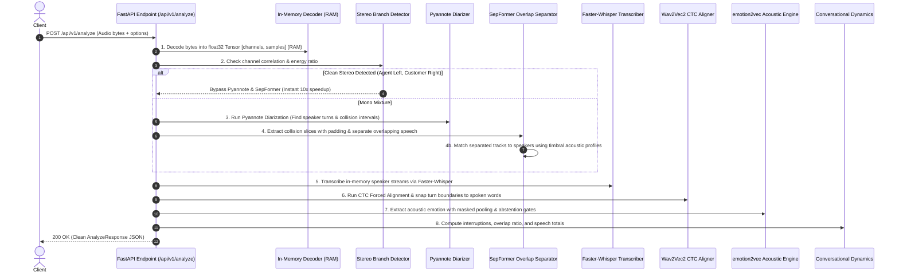

# `app` - In-Memory Audio Sentiment & Diarization Engine

`app` is a production-grade, in-memory audio analysis service designed for high throughput backend APIs. Unlike earlier CLI batch tools, `app` **generates zero intermediate WAV files on disk**, operates entirely on PyTorch/NumPy tensors in RAM/VRAM, and maintains pre-warmed models across requests.

---

## The `/api/v1/analyze` Request Flow

When an audio file is uploaded to `POST /api/v1/analyze`, it passes through an optimized 8-stage pipeline:



---

## Detailed Step-by-Step Breakdown

### 1. In-Memory Decoding (Zero Disk I/O)
* The uploaded file bytes (`wav`, `mp3`, `m4a`, `flac`) are decoded directly into a 32-bit floating point PyTorch tensor in RAM using `soundfile`.
* Resampled to the pipeline's internal sample rate (16 kHz) in memory.
* **No temporary WAV files are created on disk.**

### 2. Fast Stereo Bypass (`engine/branch.py`)
* Contact center calls often record the customer on one channel and the agent on the other.
* The branch detector computes Pearson correlation between channels:
  * If correlation $< 0.6$ and both channels have speech energy: it tags `stereo_split` and **skips Pyannote and SepFormer completely**, finishing in ~2 seconds.
  * If mono mixture: it routes to neural diarization and separation.

### 3. Diarization & Collision Detection (`engine/diarizer.py`)
* Pyannote processes the mono waveform in RAM to identify:
  * Individual speaker speech turns `[start, end]`.
  * Pairwise overlap collision intervals `[start, end, speaker_a, speaker_b]` where two or more speakers talked simultaneously.
* Filters out phantom "ghost" speakers with negligible total speech duration ($< 1.0\text{s}$).

### 4. Targeted SepFormer Overlap Separation (`engine/overlap_separator.py`)
* Instead of running heavy blind source separation over the whole audio file, SepFormer **only** runs on the detected collision intervals.
* **Context Padding**: Adds a $0.2\text{s}$ context window before and after each collision.
* **Separation**: Separates the collision into two isolated streams.
* **Timbral Speaker Matching**: Measures cosine similarity against reference MFCC profiles extracted from clean turns to determine which stream belongs to Speaker A vs Speaker B.
* **Smooth Cross-Fade**: Splices the separated audio back into each speaker's stream with a linear cross-fade to eliminate clicks/pops.

### 5. In-Memory ASR Transcription (`engine/transcriber.py`)
* Feeds each speaker's stream directly into `faster-whisper` in RAM.
* Extracts segment-level text, initial word-level timestamps, log-probabilities, and no-speech confidence.

### 6. Wav2Vec2 CTC Forced Alignment (`engine/aligner.py`)
* Uses `torchaudio`'s Wav2Vec2 CTC model to compute an emission trellis matching text characters directly to audio frames.
* **Boundary Snapping (WhisperX Technique)**: Pyannote turns frequently bleed $200\text{ms} - 500\text{ms}$ into silence or chair noise. CTC alignment trims the fat and snaps turn `start` and `end` to the exact millisecond the first and last words were spoken.

### 7. Acoustic Emotion & Abstention Gating (`engine/acoustic.py`)
* Runs `emotion2vec` on each turn to extract dominant emotion, emotion probabilities, and Valence/Arousal coordinates.
* **Strict Abstention Gates**:
  * `SHORT_TURN`: Turns shorter than $0.4\text{s}$ (e.g. coughs, mic bumps) abstain from emotion scoring rather than outputting false emotions.
  * `LOW_ENERGY`: Silent or near-zero energy slices abstain automatically.

### 8. Conversational Dynamics & Response Packaging (`services/orchestrator.py`)
* Analyzes interaction patterns across all turns:
  * Flags **Interruption** when Speaker B starts talking during Speaker A's turn and Speaker A yields within $1.0\text{s}$.
  * Computes call-level metrics: `overlap_ratio`, `overlap_s`, `interruption_count`, and `total_speech_s`.
* Returns the structured `AnalyzeResponse` JSON payload.

---

## API Reference

### `POST /api/v1/analyze`
**Request**: `multipart/form-data`

| Parameter | Type | Default | Description |
| :--- | :--- | :--- | :--- |
| `file` | `UploadFile` | *Required* | Raw audio file (`.wav`, `.mp3`, `.m4a`, `.flac`) |
| `num_speakers` | `int` | `None` | Optional expected speaker count (e.g. `2`) |
| `force_branch` | `str` | `None` | Force branch: `'stereo'`, `'mono'`, or `'no_split'` |
| `enable_overlap_separation` | `bool` | `true` | Run SepFormer on overlapping speech segments |
| `vad_filter` | `bool` | `false` | Apply Silero VAD during transcription |
| `align_words` | `bool` | `true` | Run CTC forced alignment for millisecond word timings |
| `predict_emotion` | `bool` | `true` | Run emotion2vec acoustic affect prediction |

#### Example cURL
```bash
curl -X POST "http://localhost:8000/api/v1/analyze" \
  -F "file=@/path/to/call.wav" \
  -F "num_speakers=2" \
  -F "enable_overlap_separation=true"
```

#### Example Response JSON
```json
{
  "call_id": "call.wav",
  "metrics": {
    "duration_s": 149.11,
    "total_speech_s": 118.95,
    "overlap_s": 1.60,
    "overlap_ratio": 0.0107,
    "interruption_count": 1,
    "speaker_count": 2,
    "branch_used": "mono_separated"
  },
  "speakers": ["SPEAKER_00", "SPEAKER_01"],
  "turns": [
    {
      "turn_id": "turn_000",
      "speaker": "SPEAKER_00",
      "start": 1.012,
      "end": 2.680,
      "duration": 1.668,
      "text": "Hello, welcome to ABCCAT.",
      "words": [
        {"word": "Hello", "start": 1.012, "end": 1.340, "confidence": 0.98},
        {"word": "welcome", "start": 1.360, "end": 1.820, "confidence": 0.99},
        {"word": "to", "start": 1.840, "end": 1.960, "confidence": 0.99},
        {"word": "ABCCAT", "start": 2.010, "end": 2.680, "confidence": 0.95}
      ],
      "emotion": {
        "dominant_emotion": "happy",
        "scores": {"happy": 0.82, "neutral": 0.15, "surprised": 0.03},
        "valence": 0.75,
        "arousal": 0.55,
        "abstained": false,
        "abstain_reason": null
      },
      "is_interruption": false,
      "interrupted_by": null,
      "interrupts": null,
      "overlap_ratio": 0.0107
    }
  ],
  "processing_time_s": 16.09
}
```

---

### `GET /api/v1/health`
Returns service status, active device routing, and GPU VRAM usage:
```json
{
  "status": "ok",
  "service": "app-audio-sentiment-service",
  "cuda_available": true,
  "default_device": "cuda:0",
  "device_routing": {
    "diarization": "cuda:0",
    "separation": "cuda:0",
    "asr": "cuda:0",
    "alignment": "cpu",
    "acoustic": "cpu",
    "semantic": "cpu"
  },
  "vram": {
    "device_name": "NVIDIA GeForce RTX 4090",
    "allocated_mb": 2840.12,
    "reserved_mb": 3512.00
  }
}
```

---

## Granular Device Placement (CPU vs CUDA)

Every model can be routed to CPU or CUDA independently via environment variables in `.env`:

```ini
# Global fallback
DEFAULT_DEVICE=cuda:0

# Per-model overrides
DIARIZATION_DEVICE=cuda:0
SEPARATION_DEVICE=cuda:0
ASR_DEVICE=cuda:0
ALIGNMENT_DEVICE=cpu
ACOUSTIC_DEVICE=cpu
SEMANTIC_DEVICE=cpu
```

---

## Running the Service

From the repository root:
```powershell
uvicorn app.api.app:app --app-dir server --host 0.0.0.0 --port 8000 --reload
```

Interactive Swagger documentation is available at `http://localhost:8000/docs`.
